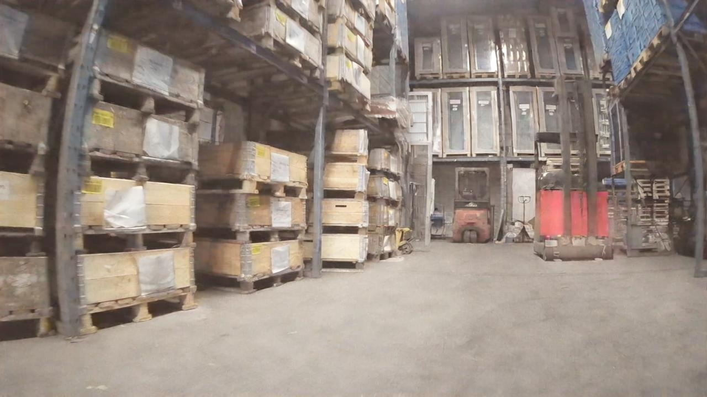
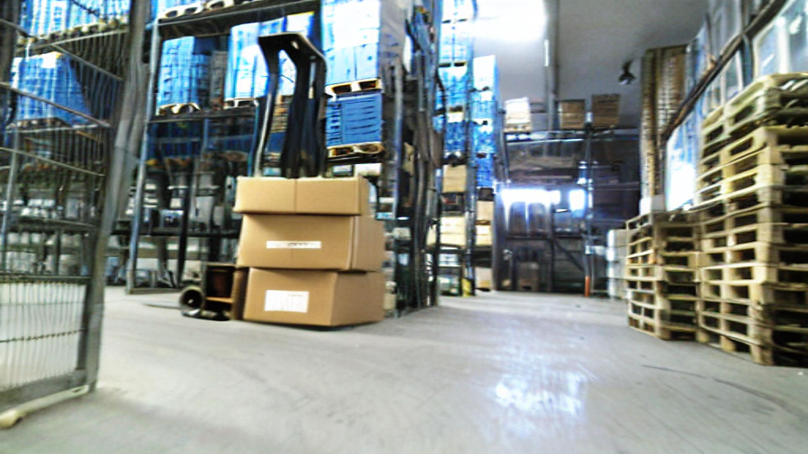

# Augmentation via Inpainting Occlusion using Latent Diffusion Models

We use inpainting models to synthetically augment training data. The code is based on the dataset [LOCO](https://github.com/tum-fml/loco), please download and follow the instructions on the original repo in downloading and processing the dataset.

This directory includes a random sub-sample of LOCO for illustration/demo purposes.

The task can be summarized as.

Given an image and a bounding box for a forklift, inpaint some occlusion objects (i.e. `stack of boxes`).

## Illustration
| Original    | Inpaining-Mask | GLIGEN |
| -------- | ------- | ------- |
|   |     |     |

## Usage

Create a clean environment, where python>3.10

e.g. using conda:

```bash
conda create --name inpainting python=3.10
```

Install the requirements

```bash
pip install -r requirements.txt
```

Run the augmentation program

```bash
python run.py --dataset ./dataset --method gligen
```

## Methods

There are three different methods experimented with for augmentation.

### 1. GLIGEN - [Ref](https://arxiv.org/abs/2301.07093)
We randomly subsample an area of the bottom right of the bounding box to occlude a forklift with some boxes. The occlusion is using the prompt `a stack of boxes`.

### 2. Refined
A way to refine occluded forklift. As some of the forklift are already occluded in the original dataset or are blurry and difficult to distinguish even by human evaluators (i.e. *me*), we use a method to refine them. We apply an inpainting model to inpaint a forklift on the bounding box which we then occlude by inpainting boxes on a small area of the bounding box. We use GLIGEN for both of those steps as it performs the best in the inpainting task from qualitative evaluation.

### 3. SDXL - [Ref](https://huggingface.co/diffusers/stable-diffusion-xl-1.0-inpainting-0.1)
A Fine-tuned SDXL model for inpainting task. We use an identical pipeline as GLIGEN but instead apply a different backbone i.e. SDXL. The two model have some major differences to begin with and we can expect a lot more degrees of freedom to experiment with inpainting strategies with an SDXL model. GLIGEN uses SD model (precursor of SDXL) and as such we can expect the larger model to perform better. However, the poor results of SDXL are a consequence of using a different inpainting method altogether.

## Qualitative Assesement

We randomly sample images and present them below for each method.
| Original    | Refined | GLIGEN | SDXL |
| -------- | ------- | ------- | ------- |
|   |      |      |      |
|   |      |      |      |
|   |      |      |      |


## Conclusions
The best method is GLIGEN. SDXL often fails to follow the prompt and appears to be sensitive to the sampling hyper-parameters. Refinement as a strategy is not a good idea. Future work can include RL-HF, quantitative evaluation metrics, and more.